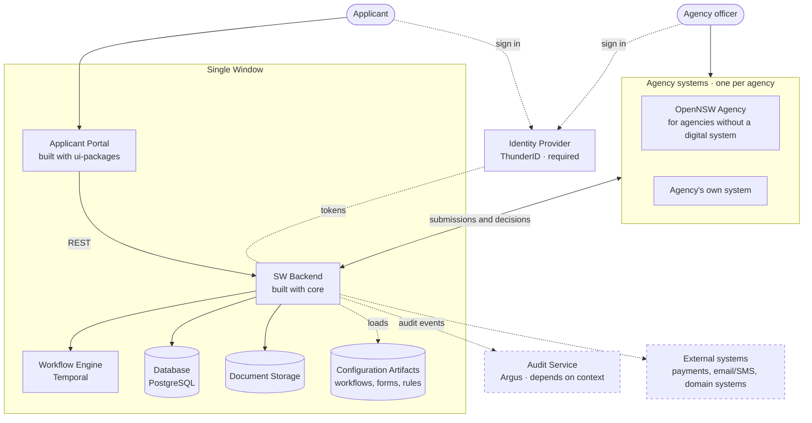
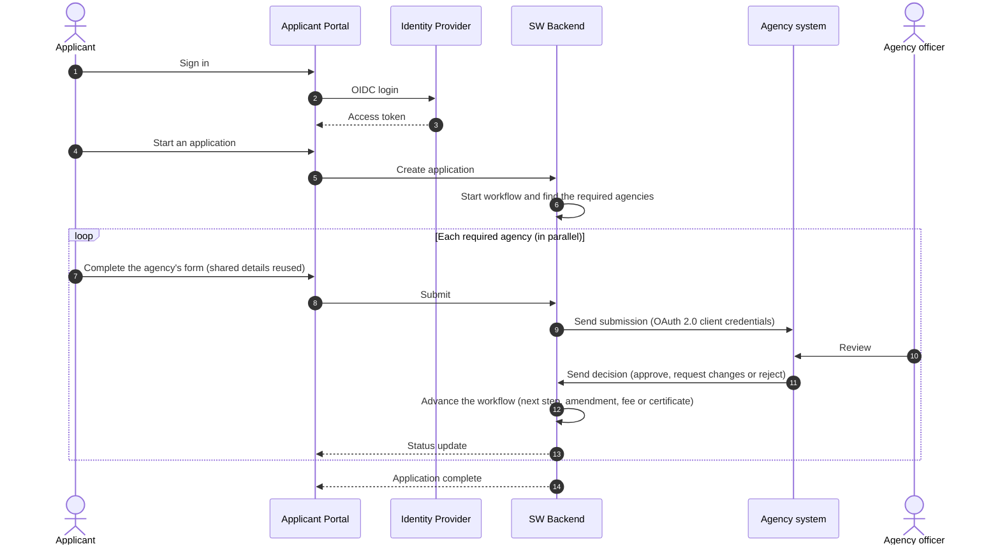

# OpenNSW
**_Open-source Digital Public Infrastructure for building National Single Window systems_**

**OpenNSW** provides open-source building blocks for **Single Window (SW)** systems: one digital entry point where applicants, such as traders, businesses and citizens, complete processes that need approvals from several government or private agencies. The building blocks handle the reusable parts (long-running workflow orchestration, human-in-the-loop tasks, schema-driven forms and a ready-to-deploy agency system), while each country or domain keeps its own workflows, forms and integrations as configuration and application code.

Trade facilitation is the first use case, but the building blocks are domain-agnostic and can power other single-window services such as investment approvals, business registration and licensing.

  <a href="#what-is-a-single-window">What is a Single Window?</a> •
  <a href="#repositories">Repositories</a> •
  <a href="#architecture">Architecture</a> •
  <a href="#roadmap">Roadmap</a> •
  <a href="#contributing">Contributing</a> •
  <a href="#license">License</a>

---

## What is a Single Window?

Without a Single Window, applicants deal with each agency separately: they enter the same information again and again, and chase approvals one office at a time. A Single Window:

* **Gives applicants one entry point** to start an application and track its progress across every agency involved.
* **Captures shared information once** and reuses it for each agency's requirements.
* **Orchestrates long-running, multi-agency processes** such as parallel reviews, amendment requests, fees, inspections and certificates, which can span days or weeks.
* **Lets each agency keep its own data and decisions**, integrating through well-defined APIs.

---

## Repositories

### Building blocks

Generic, reusable components for building any Single Window.

| Repository | Description |
|------------|-------------|
| **[core](https://github.com/OpenNSW/core)** | Go SDK for building Single Window backends: importable packages, not a deployable application. Includes a Temporal-backed, JSON-DSL workflow engine, human-in-the-loop task orchestration, a versioned configuration (artifact) registry, pluggable payments, notifications, file storage and outbound integrations, and JWT / OAuth 2.0 scope-based auth middleware. |
| **[ui-packages](https://github.com/OpenNSW/ui-packages)** | Shared UI packages for Single Window portals. Currently ships [`@opennsw/jsonforms-renderers`](https://www.npmjs.com/package/@opennsw/jsonforms-renderers), a set of [JSON Forms](https://jsonforms.io/) renderers for React (Radix Themes) that render schema-driven forms, with file uploads, searchable selects, spreadsheet and XML import/export, and computed fields. |
| **[agency](https://github.com/OpenNSW/agency)** | Deployable system for agencies that don't have a digital system to integrate with the Single Window. Officers receive submissions, review them and send decisions back to the Single Window. Each agency runs its own instance with its own database, branding and configuration. Published as a container image and Helm chart. |

### Implementations

Country-specific Single Windows built with the building blocks.

| Repository | Description |
|------------|-------------|
| **[nsw-srilanka](https://github.com/OpenNSW/nsw-srilanka)** | Sri Lanka's Trade Single Window, the first implementation built with OpenNSW. |
| **[one-trade-artifacts](https://github.com/OpenNSW/one-trade-artifacts)** | Workflows, forms, routing rules and agency task configurations for Sri Lanka's Trade Single Window. |

### Recommended open-source components

A Single Window also relies on services that OpenNSW does not build itself. We recommend:

| Component | Project | Description |
|-----------|---------|-------------|
| Identity Provider | **[ThunderID](https://thunderid.dev/)** ([GitHub](https://github.com/thunder-id)) | Open-source identity stack for authenticating and authorizing people and machines, based on OpenID Connect and OAuth 2.0. |
| Audit Service | **[Argus](https://github.com/LSFLK/argus)** | Centralized audit logging service with tamper-evident hash chaining and cryptographic signatures. |

---

## Architecture

### Minimal Single Window architecture

Solid lines are the main request flow. Dashed lines are identity (sign-in and tokens), configuration loading, audit events and external integrations. Dashed boxes are components whose need depends on the deployment.

### Components

| Component | Responsibility | Required? | Build with / recommended |
|-----------|----------------|-----------|--------------------------|
| **Applicant Portal** | Single entry point where applicants start applications, fill in forms, upload documents, pay fees and track progress. | Required | Your web app, using [ui-packages](https://github.com/OpenNSW/ui-packages) for schema-driven forms |
| **SW Backend** | APIs, workflow and task orchestration, routing to agencies, payments and notifications. | Required | Your Go application, built with [core](https://github.com/OpenNSW/core) |
| **Workflow Engine** | Durable execution of long-running, multi-agency workflows. | Required | [Temporal](https://temporal.io/) |
| **Database** | Application, task and payment state. | Required | PostgreSQL |
| **Document Storage** | Documents uploaded during an application. | Required | S3-compatible object storage or a local file system |
| **Configuration Artifacts** | Versioned workflow definitions, forms, UI layouts and routing rules. | Required | JSON files loaded by `core` from GitHub, S3 or a local directory |
| **Identity Provider** | Sign-in for applicants, agency officers and administrators, and OAuth 2.0 clients for system-to-system calls. | **Required** | [ThunderID](https://thunderid.dev/) |
| **Agency systems** | Where agency officers review submissions and record decisions. | Required (one per agency) | The agency's existing system, integrated through the Single Window's API, or an [agency](https://github.com/OpenNSW/agency) instance |
| **Audit Service** | Tamper-evident record of who did what, and when. | **Depends on context:** required where laws or policies demand an audit trail (typical for production government services), optional for pilots and sandboxes | [Argus](https://github.com/LSFLK/argus) |
| **External integrations** | Payment gateways, email and SMS, and domain systems such as customs for a trade Single Window. | Optional | Pluggable providers in `core` |

### How an application flows

### Design principles

* **Process state vs. domain data:** the Single Window tracks where each application is in its process, while agencies keep their domain data and decisions in their own systems.
* **Configuration over code:** workflows, forms, UI layouts and routing rules are versioned configuration artifacts, so most process changes need no code changes.
* **Agency data sovereignty:** each agency runs its own system and database, and integrates through a simple contract: receive a submission, send back a decision.
* **Bring your own agency system:** agencies with a digital system integrate through APIs; agencies without one deploy [OpenNSW Agency](https://github.com/OpenNSW/agency).
* **Standards-based security:** OpenID Connect sign-in for people, OAuth 2.0 client credentials for systems, and scope-based authorization on API calls.
* **Durable, long-running processes:** applications can run for days or weeks, with parallel agency reviews, amendments, fees and timers, and survive restarts.

---

## Roadmap

* **Farajaland example Single Window:** a sample Single Window implementation for Farajaland, a fictional country, with fictional agencies, workflows and data. Anyone will be able to run it and walk through a complete Single Window end-to-end.

---

## Contributing

Contributions are welcome. Open an issue or pull request in the relevant repository, and see its README and contributing guide for setup and conventions.

## License

The OpenNSW building blocks [core](https://github.com/OpenNSW/core) and [ui-packages](https://github.com/OpenNSW/ui-packages) are licensed under the [Apache License 2.0](https://www.apache.org/licenses/LICENSE-2.0). See each repository for its license.

---

An initiative of <a href="https://github.com/LSFLK">Lanka Software Foundation</a>

